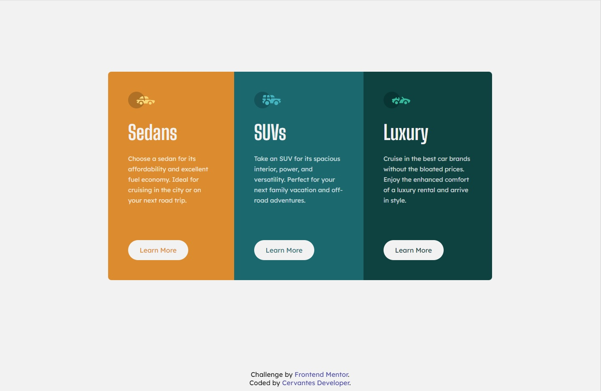

# Frontend Mentor - 3-column preview card component solution

This is a solution to the [3-column preview card component challenge on Frontend Mentor](https://www.frontendmentor.io/challenges/3column-preview-card-component-pH92eAR2-). Frontend Mentor challenges help you improve your coding skills by building realistic projects. 

## Table of contents

- [Overview](#overview)
  - [The challenge](#the-challenge)
  - [Screenshot](#screenshot)
  - [Links](#links)
- [My process](#my-process)
  - [Built with](#built-with)
  - [What I learned](#what-i-learned)
- [Author](#author)

**Note: Delete this note and update the table of contents based on what sections you keep.**

## Overview

### The challenge

Users should be able to:

- View the optimal layout depending on their device's screen size
- See hover states for interactive elements

### Screenshot

### Links

- Solution URL: [Add solution URL here](https://github.com/cervantesdeveloper/05_forntendMentor_3columnCard.git)
- Live Site URL: [Add live site URL here](https://frontend-mentor-3columncard.netlify.app/)

## My process

### Built with

- Semantic HTML5 markup
- CSS custom properties
- Flexbox
- BEM
- Mobile-first workflow

### What I learned

I learned about the fonts styles, such as line height.

## Author

- Frontend Mentor - [@cervantesdeveloper](https://www.frontendmentor.io/profile/cervantesdeveloper)
- GitHub - [cervantesdeveloper](https://github.com/cervantesdeveloper)
